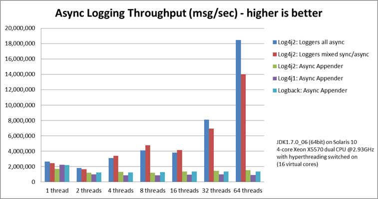
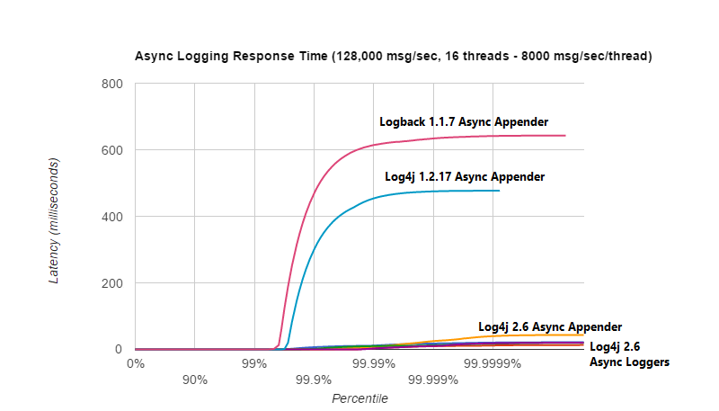
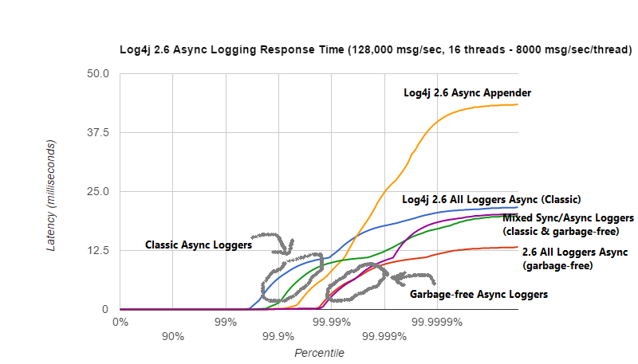

# Asynchronous Loggers for Low-Latency Logging - 低延迟异步记录器

异步日志记录通过在单独的线程中执行I/O操作来提高应用程序的性能。Log4j 2在这领域上还进一步做了一些改进。

* **异步记录器（Asynchronous Loggers）** 是Log4j 2中新增的一个功能。目的就是尽可能减少Logger.log的调用时间，让控制尽可能快速地返回到应用程序。您可以选择使所有Logger都异步，或混合使用同步和异步Logger。使所有Logger异步将提供最佳性能，而混合为您提供更强灵活性。
* **LMAX Disruptor技术**。异步记录器在内部使用[Disruptor](https://logging.apache.org/log4j/2.x/manual/async.html#UnderTheHood)，一个无锁的线程间通信库，用这个库来代替队列，实现更高的吞吐量和更低的延迟。
* Async Logger还做了一些提升，**异步追加器（Asynchronous Appenders）** 被增强，它实现批处理功能，按批（当队列为空时）把日志刷新到磁盘上。它和配置“immediateFlush=true”起到相同效果，即，所有接收的日志事件总是可以输出到磁盘上，但是却更高效，因为它无需在每个日志事件上进行磁盘操作。（Async Appenders内部使用ArrayBlockingQueue，且无需依赖disruptor jar包）。

## 权衡取舍（Trade-offs）

尽管异步日志记录提供了显著的性能优势，但在某些情况下，您可能需要选择同步日志记录。本节介绍异步日志记录的一些折衷。

### 优势

* 更高的峰值吞吐量。使用异步记录器（Asynchronous Logger），它比命名用同步记录器（Synchronous Logger）提升6~68倍的处理速率。

  这对于偶尔出现日志暴涨的应用程序特别有用。异步日志记录可以通过缩短日志记录的等待时间来防止或抑制延迟峰值。如果队列大小配置足够大以处理突发暴涨，异步日志记录可以有助于防止应用程序在突发暴涨时导致吞吐量下降（很多）。

* 降低日志响应时延。响应时延是在给定工作负载下调用Logger.log返回所花费的时间。异步记录器的时延相对于同步记录器或甚至是基于队列的异步追加器，它的时延始终更低。

### 缺陷

* 错误处理。如果在日志记录过程中发生问题并抛出异常，异步记录器或追加器很难把该问题通知到应用程序。可以通过配置`ExceptionHandler`来部分地减轻，不过这可能仍然不能覆盖所有情况。因此，如果日志是业务逻辑的一部分，例如，如果您使用Log4j作为审计日志框架，我们建议使用同步记录这些审计消息。（注意，您仍然可以混合地使用它们，除了使用同步日志记录来实现审计跟踪外，使用异步日志记录进行调试/跟踪日志信息。）

* 在极少数情景下，需要关注可变消息（mutable messages）。大多数下并不需要担心这个的。Log4j确保`logger.debug("My object is {}", myObject)`等日志消息使用的`myObject`参数的状态是在调用`logger.debug()`时那一刻的。即使`myObject`在后面被修改，日志消息也不会被更改掉。异步记录可变对象是安全的，因为Log4j内置的大多数[Message](https://logging.apache.org/log4j/2.x/log4j-api/apidocs/org/apache/logging/log4j/message/Message.html)实现都使用参数的快照。但有一些例外：[MapMessage](https://logging.apache.org/log4j/2.x/log4j-api/apidocs/org/apache/logging/log4j/message/MapMessage.html)和[StructuredDataMessage](https://logging.apache.org/log4j/2.x/log4j-api/apidocs/org/apache/logging/log4j/message/StructuredDataMessage.html)是可变的：创建Message对象后，依然可以将字段添加到这些消息中。在使用异步记录器或异步追加器记录这些消息后，您不应进行修改操作；在生成的日志输出中所做的修改您可能会看到，也可能看不到，会导致一定的混淆。类似地，自定义[Message](https://logging.apache.org/log4j/2.x/log4j-api/apidocs/org/apache/logging/log4j/message/Message.html)实现应该考虑异步的使用，在构建时就获取参数的快照，或标记它的特性是线程安全的。

* 如果您的应用程序在CPU资源稀缺的环境中运行，例如CPU是单核的机器，则启动另一个线程不太可能提供更好的性能。

* 如果应用程序记录消息的持续速率比日志追加器（appender）的最大持续吞吐量还要快，则队列将被填满，应用程序将以最慢的appender的速度进行日志记录。如果发生这种情况，请考虑选择[更快的appender](https://logging.apache.org/log4j/2.x/performance.html#whichAppender)，或日志更少些。如果这两个方案都不可选，使用同步记录可能会获得更好的吞吐量和更低的峰值延迟。

## 所有的Logger都为异步

_需要依赖disruptor-3.0.0.jar或更高版本。后续版本的Log4j 2将需要disruptor-3.3.3.jar或更高版本。_

这种是配置最简单且可以达到最佳的性能。要使所有的Logger都为异步，请将disruptor jar添加到类路径，并将系统属性`Log4jContextSelector`设置为`org.apache.logging.log4j.core.async.AsyncLoggerContextSelector`。

默认情况下，location无法通过异步logger传递给I/O线程。如果您的某个layout或自定义filter需要location信息，则需要在所有相关logger（包括root logger）的配置中设置`includeLocation=true`。

不需要location的配置如下所示：

```xml
<?xml version="1.0" encoding="UTF-8"?>

<!-- Don't forget to set system property
-DLog4jContextSelector=org.apache.logging.log4j.core.async.AsyncLoggerContextSelector
     to make all loggers asynchronous. -->

<Configuration status="WARN">
  <Appenders>
    <!-- Async Loggers will auto-flush in batches, so switch off immediateFlush. -->
    <RandomAccessFile name="RandomAccessFile" fileName="async.log" immediateFlush="false" append="false">
      <PatternLayout>
        <Pattern>%d %p %c{1.} [%t] %m %ex%n</Pattern>
      </PatternLayout>
    </RandomAccessFile>
  </Appenders>
  <Loggers>
    <Root level="info" includeLocation="false">
      <AppenderRef ref="RandomAccessFile"/>
    </Root>
  </Loggers>
</Configuration>
```

当使用`AsyncLoggerContextSelector`使所有logger都为异步时，确保在配置文件中使用普通的`<root>`和`<logger>`节点。`AsyncLoggerContextSelector`确保所有logger都是异步的，但与配置`<asyncRoot>`或`<asyncLogger>`使用不同的机制。后面将讲到如何使用这些节点混合同步和异步logger。如果你同时使用这两个机制，你会得到两个后台线程，你的应用程序将日志消息传递给线程A，线程A又将消息传递给线程B，然后线程B最终将消息写入到磁盘。这也达到了效果，但中间多了一个没必要的过程。

有几个系统属性可用于控制异步日志记录。其中一些可用于调整日志记录性能。

还可以通过创建名为`log4j2.component.properties`的文件，并将此文件包括在应用程序的类路径中来指定属性和值。

配置所有异步记录器的系统属性：

| 系统属性 | 默认值 | 描述 |
| ---- | ---- | ---- |
| AsyncLogger.ExceptionHandler | `default handler` | 实现`com.lmax.disruptor.ExceptionHandler`接口的类的完全限定名。实现类必须要有一个public的无参构造函数。如果设定，当记录消息发生异常时，将回调此类。<br> 如果未设定，则使用缺省异常处理程序，将在标准错误输出流里输出消息和堆栈跟踪。 |
| AsyncLogger.RingBufferSize |  256 * 1024 | 异步记录使用的RingBuffer的大小（插槽数）。将此值设置为足够大以处理日志量暴涨。最小值是128。RingBuffer在第一次使用时进行预先分配，且在系统生命周期中永远不会增长或收缩。<br> 当应用程序日志记录的速度快于底层appender的输出时，在很长一段时间将不断填充队列，队列满时将由[AsyncQueueFullPolicy](https://logging.apache.org/log4j/2.x/log4j-core/apidocs/org/apache/logging/log4j/core/async/AsyncQueueFullPolicy.html)决定后续的行为。 |
| AsyncLogger.WaitStrategy | `Timeout` | 有效值：`Block`、`Timeout`、`Sleep`、`Yield`。<br> `Block`是一种使用的锁和条件变量来控制I/O线程等待日志事件的策略。当CPU资源要比吞吐量和低延迟更为重要和稀缺时，可以使用Block。建议用于资源受限/虚拟化环境中。<br> `Timeout`是`Block`策略的一种变体，它将定期从锁条件await()调用中唤醒。这确保如果因某些原因错过了唤醒通知，消费者线程也不会被阻塞，而是以小延迟（默认10ms）恢复。<br> `Sleep`是在I/O线程正在等待日志事件时，首先自旋（spin），然后使用Thread.yield()，最后等待到操作系统和JVM允许的最小毫微时间的一种策略。Sleep在性能和CPU资源之间的做了一个很好的折中。此策略对应用程序线程的影响非常小，但在消息记录时会存在一些额外延迟。<br> `Yield`是一种策略，它在自旋（spin）后使用Thread.yield()等待日志事件。Yield在性能和CPU资源之间的做了一个很好的折中，但可能使用比Sleep更多的CPU，以便更快地将消息写入磁盘。 |
| AsyncLogger.ThreadNameStrategy | `CACHED` | 有效值：`CACHED`，`UNCACHED`。<br> 默认情况下，AsyncLogger在ThreadLocal变量中缓存线程名称以提高性能。如果您的应用程序在运行时修改线程名（使用`Thread.currentThread().setName()`）并且希望看到日志中反映的新线程名，请指定`UNCACHED`选项。 |
| log4j.Clock | `SystemClock` | 实现`org.apache.logging.log4j.core.util.Clock`接口，用于在所有logger都是异步时对日志事件进行记录时间戳。<br> 默认情况下，对每个日志事件调用`System.currentTimeMillis`。<br><br> `CachedClock`是针对低延迟应用程序的优化，其中时间戳从clock生成，在后台线程中clock每毫秒或每1024个日志事件（以先到者为准）更新一次内部时间。这减少了记录延迟，代价是牺牲了记录时间戳的一些精度。除非您记录了许多事件，否则在日志时间戳之间可能会看到10-16毫秒的“跳跃”。WEB应用程序警告：使用后台线程可能会导致Web应用程序和OSGi应用程序出现问题，因此不建议对此类应用程序使用`CachedClock`。<br><br> 您还可以指定实现`Clock`接口的自定义类的完全限定类名。 |

还有一些系统属性可用于维护应用程序吞吐量，即使底层appender无法跟上记录速率而且队列正在被填满。请参阅系统属性[log4j2.AsyncQueueFullPolicy和log4j2.DiscardThreshold](./configuration.md#log4j2.AsyncQueueFullPolicy)的详细信息。

## 混合同步和异步Logger

_需要依赖disruptor-3.0.0.jar或更高版本。后续版本的Log4j 2将需要disruptor-3.3.3.jar或更高版本。不需要对系统属性“Log4jContextSelector”设值。_

同步和异步logger可以在配置中混合使用。这给你更大的灵活性，代价是性能略有下降（相对于所有logger都是异步的）。使用`<asyncRoot>`或`<asyncLogger>`配置指定需要异步的logger。配置只能包含一个root logger（`<root>`或`<asyncRoot>`节点），但是可以组合异步和非异步logger节点。例如，包含`<asyncLogger>`节点的配置文件还可以包含同步的`<root>`和`<logger>`节点。

默认情况下，location无法通过异步logger传递给I/O线程。如果您的某个layout或自定义filter需要location信息，则需要在所有相关logger（包括root logger）的配置中设置`includeLocation=true`。

混合异步logger的配置可能如下所示：

```xml
<?xml version="1.0" encoding="UTF-8"?>

<!-- No need to set system property "Log4jContextSelector" to any value
     when using <asyncLogger> or <asyncRoot>. -->

<Configuration status="WARN">
  <Appenders>
    <!-- Async Loggers will auto-flush in batches, so switch off immediateFlush. -->
    <RandomAccessFile name="RandomAccessFile" fileName="asyncWithLocation.log"
              immediateFlush="false" append="false">
      <PatternLayout>
        <Pattern>%d %p %class{1.} [%t] %location %m %ex%n</Pattern>
      </PatternLayout>
    </RandomAccessFile>
  </Appenders>
  <Loggers>
    <!-- pattern layout actually uses location, so we need to include it -->
    <AsyncLogger name="com.foo.Bar" level="trace" includeLocation="true">
      <AppenderRef ref="RandomAccessFile"/>
    </AsyncLogger>
    <Root level="info" includeLocation="true">
      <AppenderRef ref="RandomAccessFile"/>
    </Root>
  </Loggers>
</Configuration>
```

有几个系统属性可用于控制异步日志记录。其中一些可用于调整日志记录性能。

还可以通过创建名为`log4j2.component.properties`的文件，并将此文件包括在应用程序的类路径中来指定属性和值。

配置混合异步和同步logger的系统属性：

| 系统属性 | 默认值 | 描述 |
| ---- | ---- | ---- |
| AsyncLogger.ExceptionHandler | `default handler` | 实现`com.lmax.disruptor.ExceptionHandler`接口的类的完全限定名。实现类必须要有一个public的无参构造函数。如果设定，当记录消息发生异常时，将回调此类。<br> 如果未设定，则使用缺省异常处理程序，将在标准错误输出流里输出消息和堆栈跟踪。 |
| AsyncLogger.RingBufferSize |  256 * 1024 | 异步记录使用的RingBuffer的大小（插槽数）。将此值设置为足够大以处理日志量暴涨。最小值是128。RingBuffer在第一次使用时进行预先分配，且在系统生命周期中永远不会增长或收缩。<br> 当应用程序日志记录的速度快于底层appender的输出时，在很长一段时间将不断填充队列，队列满时将由[AsyncQueueFullPolicy](https://logging.apache.org/log4j/2.x/log4j-core/apidocs/org/apache/logging/log4j/core/async/AsyncQueueFullPolicy.html)决定后续的行为。 |
| AsyncLogger.WaitStrategy | `Timeout` | 有效值：`Block`、`Timeout`、`Sleep`、`Yield`。<br> `Block`是一种使用的锁和条件变量来控制I/O线程等待日志事件的策略。当CPU资源要比吞吐量和低延迟更为重要和稀缺时，可以使用Block。建议用于资源受限/虚拟化环境中。<br> `Timeout`是`Block`策略的一种变体，它将定期从锁条件await()调用中唤醒。这确保如果因某些原因错过了唤醒通知，消费者线程也不会被阻塞，而是以小延迟（默认10ms）恢复。<br> `Sleep`是在I/O线程正在等待日志事件时，首先自旋（spin），然后使用Thread.yield()，最后等待到操作系统和JVM允许的最小毫微时间的一种策略。Sleep在性能和CPU资源之间的做了一个很好的折中。此策略对应用程序线程的影响非常小，但在消息记录时会存在一些额外延迟。<br> `Yield`是一种策略，它在自旋（spin）后使用Thread.yield()等待日志事件。Yield在性能和CPU资源之间的做了一个很好的折中，但可能使用比Sleep更多的CPU，以便更快地将消息写入磁盘。 |
| AsyncLogger.ThreadNameStrategy | `CACHED` | 有效值：`CACHED`，`UNCACHED`。<br> 默认情况下，AsyncLogger在ThreadLocal变量中缓存线程名称以提高性能。如果您的应用程序在运行时修改线程名（使用`Thread.currentThread().setName()`）并且希望看到日志中反映的新线程名，请指定`UNCACHED`选项。 |

还有一些系统属性可用于维护应用程序吞吐量，即使底层appender无法跟上记录速率而且队列正在被填满。请参阅系统属性[log4j2.AsyncQueueFullPolicy和log4j2.DiscardThreshold](./configuration.md#log4j2.AsyncQueueFullPolicy)的详细信息。

## Location, location, location...

若layout配置了与位置相关（location-related）的属性，如HTML [locationInfo](./layouts.md#HtmlLocationInfo)或[%C或%class](./layouts.md#PatternClass)，[%F或%file](./layouts.md#PatternFile)，[%l或%location](./layouts.md#PatternLocation)，[%L或%line](./layouts.md#PatternLine)，[%M或%method](./layouts.md#PatternMethod)其中的一个，Log4j将获取堆栈的快照，并遍历堆栈跟踪以查找位置信息。

这是很耗时操作：对于同步logger来说，要慢上1.3 - 5倍。同步logger在它们获取此堆栈快照之前尽可能长地等待。如果不需要location信息，则不会获取快照信息。

但是，异步logger需要在将日志消息传递到另一个线程之前做出此决定；该位置信息将在该点之后丢失了。对于异步logger来说，获取堆栈跟踪快照的操作对于性能的影响更大：使用位置记录比没有位置的要慢30 - 100倍。因此，默认情况下，异步logger和异步appender不包含位置信息。

您可以通过设定`includeLocation="true"`来覆盖logger或异步appender的默认行为。

## 异步Log的性能

下面的吞吐量性能结果从PerfTest，MTPerfTest和PerfTestDriver类运行结果得来，这些类可以在Log4j 2单元测试源目录中可以找到。对于吞吐量测试，使用的方法是：

* 首先，通过记录200,000条有500个字符的日志消息来预热JVM。
* 重复预热10次，然后等待10秒钟，使得I/O线程空置，缓冲区耗尽。
* 按256 * 1024 / threadCount的频率调用Logger.log，测量其所花费的时间，并以每秒消息数作为结果值。
* 重复测试5次，求平均值。

下面的结果用log4j-2.0-beta5，disruptor-3.0.0.beta3，log4j-1.2.17和logback-1.0.10获得。

### 记录峰值吞吐量

下图比较了同步logger，异步appender和异步logger的吞吐量。这是所有线程的总吞吐量。在64个线程的测试中，异步logger比异步appender **快12倍**，比同步logger **快68倍**。（那么异步appender大概是同步logger的6倍）

异步logger的吞吐量随着线程数而增加；而同步logger和异步appender不论执行日志记录的线程数，表现出或多或少的恒定吞吐量。（译者言：多线程场景下，异步logger是最优的选择！）


### 异步与其他日志包的吞吐量对比

我们还将异步logger的峰值吞吐量与其他日志记录系统中可用的同步logger和异步appender（特别是log4j-1.2.17和logback-1.0.10）进行了比较，结果类似。对于异步appender，随着线程增多时，所有线程的总吞吐量保持大致恒定。异步logger在多线程场景中更有效地使用机器上可用的多核。



在Solaris 10（64位）、4核Xeon X5570双CPU@2.93Ghz（16个虚拟核），开启超程，使用JDK1.7.0_06：

每个线程的吞吐量（以messages/second为单位）：

| Logger | 1 thread | 2 threads | 4 threads | 8 threads | 16 threads | 32 threads | 64 threads |
| ---- | ---- | ---- | ---- | ---- | ---- | ---- | ---- |
| Log4j 2: Loggers all asynchronous | 2,652,412 | 909,119 | 776,993 | 516,365 | 239,246 | 253,791 | 288,997 |
| Log4j 2: Loggers mixed sync/async | 2,454,358 | 839,394 | 854,578 | 597,913 | 261,003 | 216,863 | 218,937 |
| Log4j 2: Async Appender | 1,713,429 | 603,019 | 331,506 | 149,408 | 86,107 | 45,529 | 23,980 |
| Log4j1: Async Appender | 2,239,664 | 494,470 | 221,402 | 109,314 | 60,580 | 31,706 | 14,072 |
| Logback: Async Appender | 2,206,907 | 624,082 | 307,500 | 160,096 | 85,701 | 43,422 | 21,303 |
| Log4j 2: Synchronous | 273,536 | 136,523 | 67,609 | 34,404 | 15,373 | 7,903 | 4,253 |
| Log4j1: Synchronous | 326,894 | 105,591 | 57,036 | 30,511 | 13,900 | 7,094 | 3,509 |
| Logback: Synchronous | 178,063 | 65,000 | 34,372 | 16,903 | 8,334 | 3,985 | 1,967 |

在Windows 7（64位）、双核Intel i5-3317u CPU@1.70Ghz（4个虚拟核），开启超程，使用JDK1.7.0_11：

每个线程的吞吐量（以messages/second为单位）：

| Logger | 1 thread | 2 threads | 4 threads | 8 threads | 16 threads | 32 threads | 64 threads |
| ---- | ---- | ---- | ---- | ---- | ---- | ---- | ---- |
| Log4j 2: Loggers all asynchronous | 1,715,344 | 928,951 | 1,045,265 | 1,509,109 | 1,708,989 | 773,565 |
| Log4j 2: Loggers mixed sync/async | 571,099 | 1,204,774 | 1,632,204 | 1,368,041 | 462,093 | 908,529 |
| Log4j 2: Async Appender | 1,236,548 | 1,006,287 | 511,571 | 302,230 | 160,094 | 60,152 |
| Log4j1: Async Appender | 1,373,195 | 911,657 | 636,899 | 406,405 | 202,777 | 162,964 |
| Logback: Async Appender | 1,979,515 | 783,722 | 582,935 | 289,905 | 172,463 | 133,435 |
| Log4j 2: Synchronous | 281,250 | 225,731 | 129,015 | 66,590 | 34,401 | 17,347 |
| Log4j1: Synchronous | 147,824	72,383 | 32,865 | 18,025 | 8,937 | 4,440 |
| Logback: Synchronous | 149,811 | 66,301 | 32,341 | 16,962 | 8,431 | 3,610 |

### 响应时延

[响应时间（Response Time）](https://logging.apache.org/log4j/2.x/performance.html#responseTime)是在特定负载下记录消息所需的时间。通常延迟实际上就是 _服务时间（service time）_：执行操作所需的时间。这隐藏了一个细节，即服务时间中的单个峰值包含了许多后续操作的排队延迟。服务时间很容易测量，但对用户来说是没太大意义，因为它省略了等待服务所花费的时间。为此，我们在这里给出的响应时间是：服务时间加上等待时间。

下面的响应时间测试结果都是从Log4j 2单元测试源目录中的ResponseTimeTest类运行得来的。如果你想自己运行这些测试，这里列示了我们使用的命令行选项：

* -Xms1G -Xmx1G（在测试期间防止堆调整大小）
* -DLog4jContextSelector=org.apache.logging.log4j.core.async.AsyncLoggerContextSelector -DAsyncLogger.WaitStrategy=busyspin（使用异步logger，BusySpin等待策略减少抖动。）
* **经典模式（classic mode）：** -Dlog4j2.enable.threadlocals=false -Dlog4j2.enable.direct.encoders=false
  **无垃圾模式（garbage-free mode）：** -Dlog4j2.enable.threadlocals=true -Dlog4j2.enable.direct.encoders=true
* -XX:CompileCommand=dontinline,org.apache.logging.log4j.core.async.perftest.NoOpIdleStrategy::idle
* -verbose:gc -XX:+PrintGCDetails -XX:+PrintGCDateStamps -XX:+PrintTenuringDistribution -XX:+PrintGCApplicationConcurrentTime -XX:+PrintGCApplicationStoppedTime（eyeball GC和保持点暂停--safepoint pauses）

下面的图表将Logback 1.1.7，Log4j 1.2.17中基于ArrayBlockingQueue的异步appender的响应时延，与Log4j 2.6提供的各种异步log机制进行了比较。在每秒128,000条消息的工作负载下，使用16个线程（每个以每秒8,000条消息的速率进行日志记录），我们看到Logback 1.1.7，Log4j 1.2.17得到的延迟峰值比Log4j 2大几个数量级（译者言：大得有点夸张了！）。



下面的图表放大了上图中的Log4j 2结果。我们看到，基于ArrayBlockingQueue的Async Appender的响应时间最高。[无垃圾](./garbagefree.md)的异步logger具有最佳的响应时间。



## 底层技术点

异步logger使用[LMAX Disruptor](http://lmax-exchange.github.com/disruptor/)作为线程间消息通信。 从LMAX网站可以看到：

> ...使用队列在系统的各层之间传递数据，会导致延迟，所以我们专注于优化这点。Disruptor是我们研究和测试的结果。我们发现CPU的缓存失效和需要内核仲裁的锁都是非常耗时的，所以我们创建了一个框架，它对运行的硬件有“[机器同情（Mechanical Sympathy）](https://mechanical-sympathy.blogspot.com/)”（译者言：中文描述可见[这里](http://ifeve.com/mechanical-sympathy/)）功能，并且是无锁的。

LMAX的Disruptor内部性能与`java.util.concurrent.ArrayBlockingQueue`的比较可以在[这里](https://github.com/LMAX-Exchange/disruptor/wiki/Performance-Results)找到。
