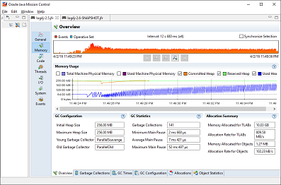
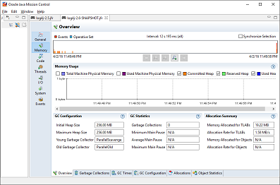
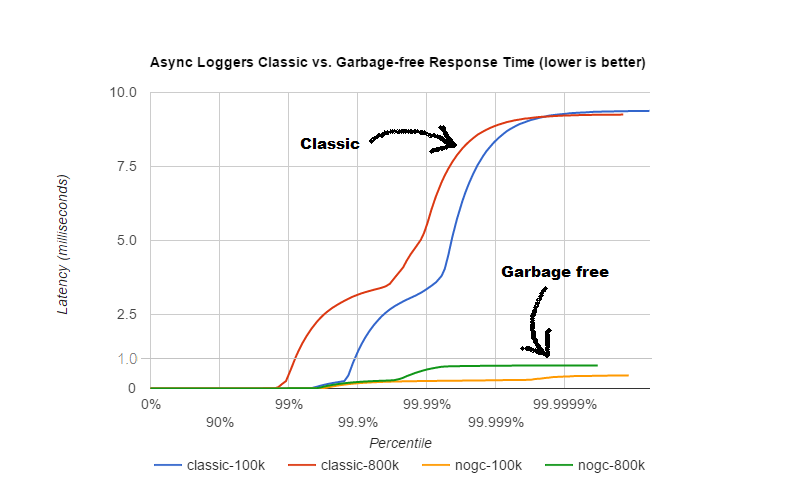
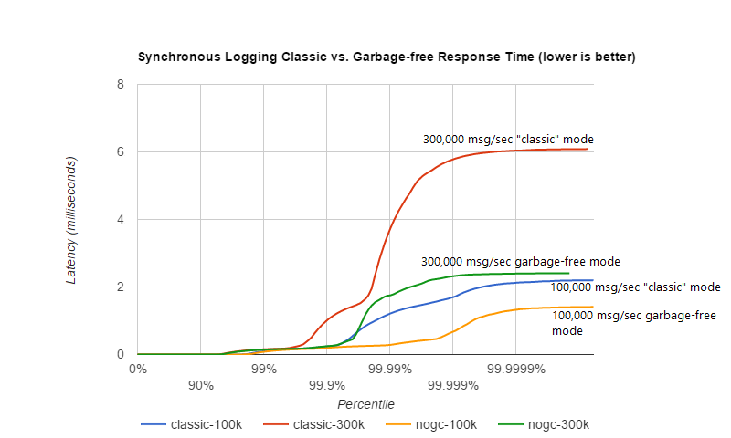
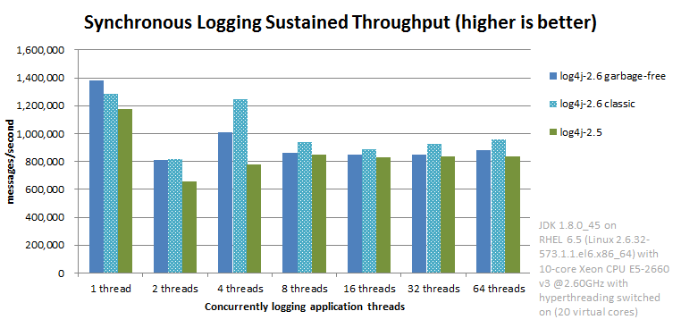

# Garbage-free Steady State Logging 无垃圾的稳态日志记录

垃圾回收出现的线程暂停是导致高延迟的常见原因，对于许多系统来说，花费了大量精力去控制这些暂停。

许多日志库（包括先前版本的Log4j）为了保证稳定状态日志，在记录期间会分配临时对象（如日志事件对象log event objects，字符串Strings，字符数组char arrays，字节数组byte arrays等）。这大大增加了垃圾收集器的压力，增大了GC暂停发生的频率。

从版本2.6开始，Log4j在默认情况下以“无垃圾（garbage free）”模式运行，其中对象和缓冲区被重用，且尽可能不分配临时对象。还有一个“低垃圾（low garbage）”模式，它不是完全无垃圾，但不使用ThreadLocal。这是Log4j检测到它在Web应用程序中运行时的默认模式。而且，还可以关闭所有无垃圾逻辑并以“经典模式（classic mode）”运行。

## 示例

为了说明无垃圾日志记录的不同，我们使用Java Flight Recorder来测量一个简单的应用程序，它只记录一个简单的字符串，尽可能频繁地记录，大约12秒。

应用程序使用Async Loggers，RandomAccessFile appender和“%d %p %c{1.} \[%t\] %m %ex%n”模式的layout。（Async Loggers使用Yield WaitStrategy。）

面板里显示，使用Log4j 2.5这个应用程序以大约809MB/秒的速率分配内存，导致141次小垃圾回收。Log4j 2.6中不分配临时对象，因此与Log4j 2.6相同的应用程序以1.6MB/秒的内存分配速率，且是无GC，具有0（零）垃圾回收。

使用Log4j 2.5：内存分配速率809MB/秒，141个minor gc动作：



Log4j 2.6没有分配临时对象：0（零）垃圾回收：



## 配置

Log4j 2.6中的无垃圾日志记录功能，部分通过在ThreadLocal字段中重用对象来实现，部分通过在将文本（text）转换为字节（bytes）时重用缓冲区来实现。

当应用程序服务器的线程池在取消部署Web应用程序后继续引用ThreadLocal里的字段时，保存非JDK类的ThreadLocal字段可能会导致Web应用程序出现内存泄漏。为了避免引起内存泄漏，当Log4j检测到它在Web应用程序中使用时（当`javax.servlet.Servlet`类位于类路径中时，或者当系统属性`log4j2.is.webapp`设置为“`true`”），将不使用ThreadLocal。

一些减少垃圾的功能不依赖于ThreadLocals，且默认开启：在Log4j 2.6中，将日志事件（log events）转换为文本（text）和文本（text）转换为字节（bytes），可以通过直接将文本（text）编码为重用的ByteBuffer，而不创建中间的字符串（Strings），字符串（char arrays）和字节数组（byte arrays）。因此，尽管日志对于Web应用程序来说不是完全无垃圾的，但是垃圾回收器上的压力仍然可以显著降低。

> **注1：** 从版本2.6开始，包含`<Properties>`部分的Log4j配置将导致在稳态日志记录期间创建临时对象。
>
> **注2：** Async Logger Timeout等待策略（默认）和Block等待策略会导致创建`java.util.concurrent.locks.AbstractQueuedSynchronizer$Node`对象。Yield和Sleep等待策略是无垃圾的。（见[这里](./async.md#SysPropsAllAsync)和[这里](./async.md#SysPropsMixedSync-Async)。）

### 禁用无垃圾日志记录（Disabling Garbage-free Logging）

有两个单独的系统属性，用于手动控制Log4j用于避免创建临时对象的机制：

* `log4j2.enable.threadlocals` - 如果“true”（非Web应用程序的默认值）对象存储在ThreadLocal字段中并可以重用，否则为每个日志事件创建新对象。
* `log4j2.enable.direct.encoders` - 如果“true”（默认），日志事件将转换为文本，且此文本将转换为字节，而不创建临时对象。注意：由于共享缓冲区上的同步机制，在多线程应用程序情形下使用同步日志记录，此模式性能可能会更差。如果您的应用程序是多线程的并且日志记录性能很重要，请考虑使用Async Logger。
* hreadContext map默认情况下不是无垃圾的，但是从Log4j 2.7开始，通过将系统属性`log4j2.garbagefree.threadContextMap`设置为“true”，可以将其配置为无垃圾。

除了配置系统属性外，还可以在名为`log4j2.component.properties`的文件中指定上述属性，将此文件包含在应用程序的类路径中。

### 支持的Appenders

在稳态记录期间，以下[appenders](./appenders.md)是无垃圾的：

* Console
* File
* RollingFile（在文件滚动期间创建一些临时对象）
* RandomAccessFile
* RollingRandomAccessFile（在文件滚动期间创建一些临时对象）
* MemoryMappedFile

不在上述列表中其他任何的appender（包括AsyncAppender）在稳态日志记录期间会创建临时对象。代替AsyncAppender，使用[Async Loggers](./async.md)可以以无垃圾的方式异步记录日志。

### 支持的Filters

在稳态记录期间，以下[filters](./filters.md)是无垃圾的：

* CompositeFilter（为了线程安全，添加和删除filter元素创建了临时对象）
* DynamicThresholdFilter
* LevelRangeFilter（从2.8开始无垃圾）
* MapFilter（从2.8开始无垃圾）
* MarkerFilter（从2.8开始无垃圾）
* StructuredDataFilter（从2.8开始无垃圾）
* ThreadContextMapFilter（从2.8开始无垃圾）
* ThresholdFilter（从2.8开始无垃圾）
* TimeFilter（从2.8开始无垃圾）

其他过滤器像BurstFilter，RegexFilter和ScriptFilter要做到无垃圾不是件容易的事，目前没有计划改变它们。

### 支持的Layouts

#### GelfLayout

GelfLayout配置compressionType="OFF"时，只要没有额外的字段包含'${'（变量替换），是无垃圾的。

#### PatternLayout

若PatternLayout使用下面这些受限的转换模式是无垃圾的。格式修饰符控制诸如字段宽度（field width），填充（padding），左右对齐（left and right justification）这样的东西不会产生垃圾。

| 转换模式 | 描述 |
| ---- | ---- |
| %c{precision}, %logger{precision} | Logger名 |
| %d, %date | 注意：只有预定义的日期格式是无垃圾的：（毫秒分隔符可以是逗号','或'句号'.'）<br> <table><thead><tr><th>Pattern</th><th>Example</th></tr></thead><tbody><tr><td>%d{DEFAULT} </td><td> 2012-11-02 14:34:02,781 </td></tr><tr><td> %d{ISO8601} </td><td> 2012-11-02T14:34:02,781 </td></tr><tr><td> %d{ISO8601_BASIC} </td><td> 20121102T143402,781 </td></tr><tr><td> %d{ABSOLUTE} </td><td> 14:34:02,781 </td></tr><tr><td> %d{DATE} </td><td> 02 Nov 2012 14:34:02,781 </td></tr><tr><td> %d{COMPACT} </td><td> 20121102143402781 </td></tr><tr><td> %d{HH:mm:ss,SSS} </td><td> 14:34:02,781 </td></tr><tr><td> %d{dd MMM yyyy HH:mm:ss,SSS} </td><td> 02 Nov 2012 14:34:02,781 </td></tr><tr><td> %d{HH:mm:ss}{GMT+0} </td><td> 18:34:02 </td></tr><tr><td> %d{UNIX} </td><td> 1351866842 </td></tr><tr><td> %d{UNIX_MILLIS} </td><td> 1351866842781 </td></tr><tr></tbody></table> |
| %enc{pattern}, %encode{pattern} | 对特殊字符（如“\n”和HTML字符）进行编码，以协助防止日志伪造和在Web浏览器中显示日志时可能发生的一些XSS攻击 - 从2.8开始，无垃圾 |
| %equals{pattern}{test}{substitution}, %equalsIgnoreCase{pattern}{test}{substitution} | 计算pattern表达式，使用'substitution'字符串，替换出现的'test'字符串 - 从2.8开始，无垃圾 |
| %highlight{pattern}{style} | 添加ANSI颜色 - 从2.7开始无垃圾（除非嵌套模式不是无垃圾的） |
| %K{key}, %map{key}, %MAP{key} | 输出[MapMessage](https://logging.apache.org/log4j/2.x/log4j-api/apidocs/org/apache/logging/log4j/message/MapMessage.html)中的条目 - 从2.8开始无垃圾 |
| %m, %msg, %message | 日志消息（若消息文本不包含"${"，无垃圾） |
| %marker | 标记的全名（包括父类） - 从2.8开始，无垃圾 |
| %markerSimpleName | 标记的简名（不包括父类） |
| %maxLen, %maxLength | 定义最大数目的字符进行截断 - 从2.8开始，无垃圾 |
| %n | 平台相关的行分隔符 |
| %N, %nano | 记录事件时的System.nanoTime() |
| %notEmpty{pattern}, %varsNotEmpty{pattern}, %variablesNotEmpty{pattern} | 当且仅当模式中的所有变量都不为空时，输出计算模式的结果 - 从2.8开始，无垃圾 |
| %p, %level | log日志级别 |
| %r, %relative | 从JVM启动到创建日志记录事件所经过的毫秒数 - 从2.8开始，无垃圾 |
| %sn, %sequenceNumber | 在每个事件中增加的序列号 - 从2.8开始，无垃圾 |
| %style{pattern}{ANSI style} | 消息样式化 - 从2.7开始，无垃圾（除非嵌套模式不是无垃圾的） |
| %T, %tid, %threadId | 生成日志记录事件的线程ID |
| %t, %tn, %thread, %threadName | 生成日志记录事件的线程名 |
| %tp | 生成日志记录事件的线程优先级(priority) |
| %X{key\[,key2...\]}, %mdc{key\[,key2...\]}, %MDC{key\[,key2...\]} | 输出与生成日志事件的线程相关联的Thread Context Map（也称为映射诊断上下文或MDC）里的值 - 从2.8开始无垃圾 |

其他PatternLayout转换模式和其他布局可能会更新，以避免在将来的版本中创建临时对象。

注意：记录异常和堆栈跟踪信息在任何的layout里都会创建临时对象。（但是，layout只会在实际发生异常时创建这些临时对象。）我们还没有想出一种不创建临时对象来记录异常和堆栈跟踪信息的方法。

> **注意：** 包含正则表达式的pattern和用于属性替换的lookup将导致在稳态记录期间创建临时对象。
>
> 包括location信息是通过走一个异常的stacktrace方式来完成，它会创建临时对象，因此以下模式不是无垃圾的：
>
> * %C, %class -- Class Name
> * %F, %file -- File Location
> * %l, %location -- Location
> * %L, %line -- Line Location
> * %M, %method -- Method Location
>
> 此外，用于格式化Throwables的模式转换器不是无垃圾的：
>
> * %ex, %exception, %throwable -- 绑定到LoggingEvent的Throwable跟踪信息
> * %rEx, %rException, %rThrowable -- 与%ex相同，但包括包装的异常信息
> * %xEx, %xException, %xThrowable -- 与%ex相同，但包括包（class packaging）信息
> * %u, %uuid -- 格式化时创建新的随机或基于时间的UUID

## API更新

Logger接口里增加了一些方法，以便在记录最多十个参数的消息时不会创建vararg数组对象。

此外，Logger接口也增加了接收`java.lang.CharSequence` messages参数的方法。可以记录实现`CharSequence`接口的自定义对象，而不创建临时对象：Log4j将尝试通过将CharSequence messages，Object messages和message参数作为CharSequence追加到StringBuilder来将其转换为文本。这避免在这些对象上调用`toString()`。

另一种方法是实现`org.apache.logging.log4j.util.StringBuilderFormattable`接口。如果记录实现此接口的对象，则调用其`formatTo`方法而不是`toString()`。

当禁用无垃圾日志记录功能时（当系统属性`log4j2.enable.threadlocals`设置为“false”），Log4j会调用消息和参数对象的`toString()`方法。

### 对应用程序代码的影响：自动装箱（Autoboxing）

Log4j尽可能地使得无需更改现有应用程序的任何代码来达到日志无垃圾功能，但这里有一处地方是无法达到这个目的的。当记录原始值（即int，double，boolean等）时，JVM将这些原始值自动装箱到它们对等的包装对象上，从而产生垃圾。

Log4j提供了一个`Unbox`实用程序来防止原始参数的自动装箱。这个实用程序包含一个重用`StringBuilders`的本地线程池。`Unbox.box(primitive)`方法直接写入`StringBuilder`，并且生成的文本将被复制到最终的日志消息文本中，而不创建临时对象。

```java
import static org.apache.logging.log4j.util.Unbox.box;

...
public void garbageFree() {
    logger.debug("Prevent primitive autoboxing {} {}", box(10L), box(2.6d));
}
```

> **注意：** 并非所有的日志记录都是无垃圾的。特别是：
>
> * 默认ThreadContext map不是无垃圾的，但可以通过设置系统属性`log4j2.garbagefree.threadContextMap`为`true`来达到无垃圾功能。
> * ThreadContext stack不是无垃圾的。
> * 记录超过10个参数会创建可变参数数组（vararg arrays）。
> * 当所有logger都是Async Logger时，记录非常大的消息（超过518个字符）将导致RingBuffer内部的StringBuilder被修剪到它们的最大大小。
> * 记录包含'${'：替换${variable}的消息将创建临时对象。
> * 使用lambda作为 _参数_（`logger.info("lambda value is {}", () -> callExpensiveMethod())`）创建一个可变参数数组（vararg arrays）。但记录lambda表达式本身是无垃圾的：`logger.debug(() -> callExpensiveMethod())`。
> * `Logger.traceEntry`和`Logger.traceExit`方法创建临时对象。

## 性能

### 响应时延

[响应时间（Response Time）](https://logging.apache.org/log4j/2.x/performance.html#responseTime)是在特定负载下记录消息所需的时间。通常延迟实际上就是 _服务时间（service time）_：执行操作所需的时间。这隐藏了一个细节，即服务时间中的单个峰值包含了许多后续操作的排队延迟。服务时间很容易测量，但对用户来说是没太大意义，因为它省略了等待服务所花费的时间。为此，我们在这里给出的响应时间是：服务时间加上等待时间。有关更多详细信息，请参阅[性能文档的响应时间](https://logging.apache.org/log4j/2.x/performance.html#responseTime)部分。

下面的响应时间测试结果都是从Log4j 2单元测试源目录中的ResponseTimeTest类运行得来的。如果你想自己运行这些测试，这里列示了我们使用的命令行选项：

* -Xms1G -Xmx1G（在测试期间防止堆调整大小）
* -DLog4jContextSelector=org.apache.logging.log4j.core.async.AsyncLoggerContextSelector -DAsyncLogger.WaitStrategy=busyspin（使用异步logger，BusySpin等待策略减少抖动。）
* **经典模式（classic mode）：** -Dlog4j2.enable.threadlocals=false -Dlog4j2.enable.direct.encoders=false
  **无垃圾模式（garbage-free mode）：** -Dlog4j2.enable.threadlocals=true -Dlog4j2.enable.direct.encoders=true
* -XX:CompileCommand=dontinline,org.apache.logging.log4j.core.async.perftest.NoOpIdleStrategy::idle
* -verbose:gc -XX:+PrintGCDetails -XX:+PrintGCDateStamps -XX:+PrintTenuringDistribution -XX:+PrintGCApplicationConcurrentTime -XX:+PrintGCApplicationStoppedTime（eyeball GC和保持点暂停--safepoint pauses）

### Async Loggers

下面的图表将Log4j的Async Loggers的“经典（classic）”日志记录与无垃圾日志记录的响应时间进行比较。在图中，“100k”表示以100,000个消息/秒的持续负载记录，“800k”表示800,000个消息/秒的持续负载。



在 **经典（classic）** 模式中，我们看到大量的Minor GC动作，应用程序线程被暂停3毫秒或更多时间。几乎可以导致10毫秒的响应时延。如图所示，增加负载会将曲线向左移（有更大峰值）。这是因为：越多的日志意味着对垃圾收集器造成越大的压力，导致更高频繁的的Minor GC暂停。我们尝试减少负载到50,000或甚至5000消息/秒，但这并没有消除3毫秒的暂停，它只是使它们发生频繁变小了。请注意，此测试中的所有GC暂停都是Minor GC暂停。我们没有看到任何Full GC行为。

在 **无垃圾（garbage-free）** 模式下，在很大一段负载范围内，最大响应时间仍然远远低于1毫秒。（800,000消息/秒下，最大780微秒；600,000消息/秒下，最大407微秒；所有负载高达800,000条/秒时，99%大约在5微秒左右）增加或减少负载不会改变响应时延。我们没有深入调查在这些测试中看到的200-300微秒暂停的原因。

当我们进一步增加负载时，我们开始看到对于经典和无垃圾日志记录都有更大的响应时间停顿。在100万条消息/秒或更多的持续负载下，开始接近底层RandomAccessFile Appender的最大吞吐量（请参见下面的同步日志记录吞吐量图表）。在这些负载下，ringbuffer开始填满，压力开始上来：在ringbuffer已满时尝试添加另一条消息将阻塞，直至有空余空间。开始会看到几十毫秒或更长的响应时间；若再试图增加负载会导致更大更大的响应时延峰值。

### 同步文件记录

使用同步文件日志记录，无垃圾日志记录仍然比经典日志记录更好，但差异不太明显。

在100,000条消息/秒的工作负载下，经典的日志记录最大响应时间略大于2毫秒，而无垃圾日志记录稍微超过1毫秒。当工作负载增加到30万条消息/秒时，经典日志记录的响应时间暂停为6毫秒，而无垃圾的响应时间小于3毫秒。可能可以改进优化，但我们没有进一步深入调查分析。



上述结果是使用ResponseTimeTest类获得的，它可以在Log4j 2单元测试源目录中找到，该代码在RHEL 6.5（Linux 2.6.32-573.1.1.el6.x86_64）上的JDK 1.8.0_45上运行，具有10核Xeon CPU E5-2660 v3@2.60GHz，启用超程（20个虚拟核心）。

### 经典日志具有更高的吞吐量

与经典日志记录相比，无垃圾日志记录的吞吐量稍差。对于同步和异步日志记录都是如此。下图比较了在无垃圾模式，经典模式和Log4j 2.5中同步日志记录到具有Log4j 2.6的文件的持续吞吐量。



上面的结果是使用[JMH](http://openjdk.java.net/projects/code-tools/jmh/) Java基准线束获得的。请参见log4j-perf模块中的FileAppenderBenchmark源代码。

## 底层技术

实现`org.apache.logging.log4j.util.StringBuilderFormattable`的自定义消息可以通过无垃圾的layout直接转换为文本而不需要创建临时对象。`PatternLayout`使用这种机制，其他的layout也可能使用此接口将LogEvents转换为文本。

自定义layout可以通过实现`Encoder<LogEvent>`接口来达到无垃圾的功能。对于自定义Layouts，将LogEvent转换为文本表示，`org.apache.logging.log4j.core.layout.StringBuilderEncoder`类提供了一些工具方法，对于以无垃圾的方式将文本转换为字节提供一些有用的辅助。

自定义Appender想实现无垃圾，应该为它们的layout提供一个`ByteBufferDestination`实现，该layout可以直接写入。

`AbstractOutputStreamAppender`已被更新，使得ConsoleAppender，(Rolling)FileAppender，(Rolling)RandomAccessFileAppender和MemoryMappedFileAppender实现无垃圾功能。已尽可能地减少对扩展`AbstractOutputStreamAppender`的自定义Appender的影响，但不可能保证对超类的更改不会影响到任何子类。扩展`AbstractOutputStreamAppender`的自定义appenders应验证功能是否还正常。如果有问题，可以设置系统属性`log4j2.enable.direct.encoders`为“false”，以恢复到Log4j 2.6之前的行为。
